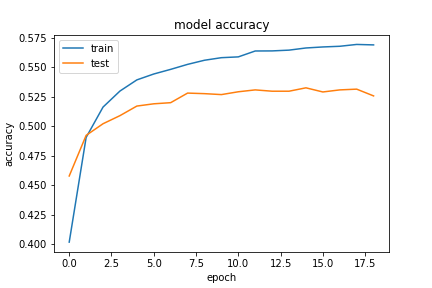
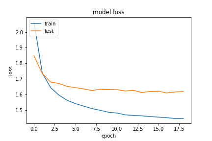

# Predective_text
A LSTM, RNN based model that auto suggest the next character/word on the basis of previous text input.

Just like auto-suggest in phones while typing, this model was build in order to auto-suggest the next keyword on the basis of
previous input text. 

This model uses Long-Short-Term-Memory in order to remember the entire sequence of text.

### Architecture
This model uses the following Layers :
1. LSTM layer 
2. Dropout Layer
3. Dense Layer

### Hyperparameters
After tuning various hyperparameters the best performace was found at... 
```
LSTM_layers=128, Dropout=0.2, Activation_function="Softmax", optimizer=RMSprop, learning-rate=0.01
```
The process terminated at 19 epoch using Earlystopping callback as with further epoch the model might start getting overfitted.
It took around 20min to train on my machine without GPU.

### Performace
The model shows accuracy of 56% and validation_accuracy of 52% with loss of 1.44, which is acceptable as we want the model to 
understand the text and not cram it completely.



### Results
The first line is input sequence of 40 words and the output resembles the top 5 suggestions predicted by the model.
```
Input: those who work honestly have the courage
Output: [' the ', ', ', '--they ', 'd ', 'ness ']

Input: the pain is temporary but the results ar
Output: ['e ', 'tists ', 'ound ', 'a ', 'id ']

Input: i'm not upset that you lied to me but th
Output: ['e ', 'at ', 'is ', 'ought ', 'rough ']

Input: and those who were seen dancing were the
Output: [' strength ', 're ', 'ir ', 'y ', 'mselves ']

Input: it is hard enough to remember my opinion
Output: [' of ', 's ', ', ', '. ', '--the ']
```

The model was trained on various other hyperparameters to obtain different results. The results can be found at the bottom of the lstm.py
